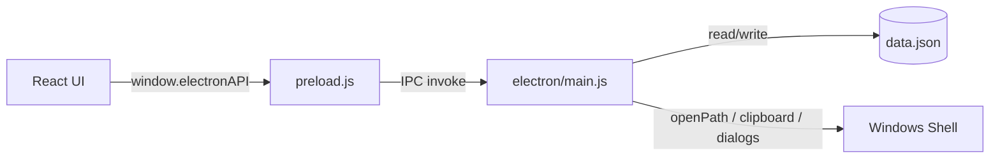

# Project Explorer

App de escritorio (Electron + React) para guardar y explorar tus proyectos en formato “tarjetas”: podés **buscar**, **filtrar** por categorías/tags, **agregar/editar/eliminar** y abrir la carpeta del proyecto desde el sistema.

## Uso rápido

- Instalar dependencias: `npm install`
- Abrir la app: `npm start` (compila React y abre Electron)
- Generar build web: `npm run build`
- Empaquetar para Windows (installer): `npm run dist`

Los datos se persisten en `data.json` (en desarrollo se usa `public/data.json`; empaquetado se guarda en `%AppData%\ProjectExplorer\data.json`).

## Cómo funciona (simple)

La UI React lee/filtra la lista, y cuando guardás cambios llama a Electron por IPC para persistir el JSON y para acciones del sistema (abrir una carpeta, copiar texto, elegir imágenes/carpetas).

