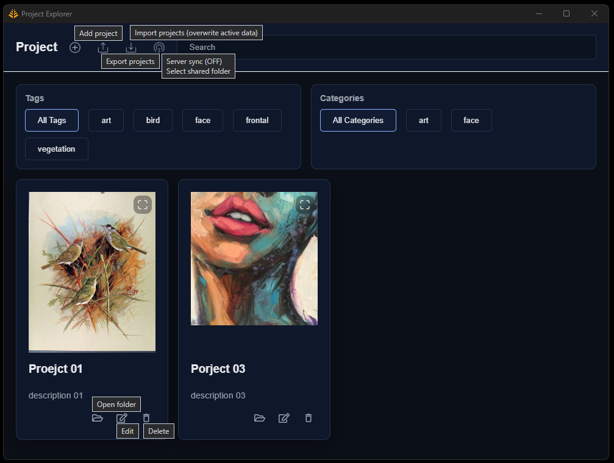

# Project Explorer

Desktop app (Electron + React) to save and explore your projects in a “card” format: you can **search**, **filter** by categories/tags, **add/edit/delete**, and open the project folder from the system.

## Quick start

- Install dependencies: `npm install`
- Open the app (development, auto-reload): `npm start`
- Open the app (build/local mode, as before): `npm run start:prod`
- Generate web build: `npm run build`
- Package for Windows (installer): `npm run dist`

Data is persisted in `data.json` (in development it uses `public/data.json`; packaged version is saved in `%AppData%\ProjectExplorer\data.json`).

## How it works (simple)

The React UI reads/filters the list, and when you save changes it calls Electron via IPC to persist the JSON and for system actions (open a folder, copy text, choose images/folders).
